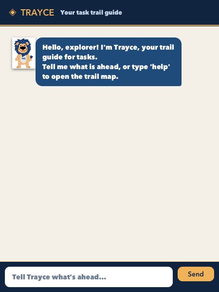

# Trayce User Guide



Trayce is a friendly task trail guide for todos, deadlines, events, and reference notes. Enter a
command in the message box and press **Enter** or click **Send**. Trayce saves every change, so your
trail is restored the next time you open the application.

## Quick start

1. Ensure that Java 25 is installed on your computer.
2. Place `trayce.jar` in the folder where you want Trayce to store its data.
3. Open a terminal in that folder and run:

   ```shell
   java -jar trayce.jar
   ```

4. Wait for the Trayce window to appear.
5. Type a command in the message box and press **Enter**, or click **Send**. Try `help` first to see
   the command trail map.

Commands are not case-sensitive, and extra spaces around command details are accepted.

## Command format

Words written in `UPPER_CASE` are values you supply. For example, replace `DESCRIPTION` in
`todo DESCRIPTION` with text such as `read chapter 3`. Do not type the angle brackets shown in
Trayce's help response. `NUMBER` means the positive item number displayed by `list`.

| Action | Command |
| --- | --- |
| Add a todo | `todo DESCRIPTION` |
| Add a deadline | `deadline DESCRIPTION /by YYYY-MM-DD` |
| Add an event | `event DESCRIPTION /from YYYY-MM-DD /to YYYY-MM-DD` |
| Record a note | `note TEXT` |
| View everything | `list` |
| Complete a task | `mark NUMBER` |
| Reopen a task | `unmark NUMBER` |
| Remove an item | `delete NUMBER` |
| Search descriptions | `find KEYWORD` |
| Show command help | `help` |

Dates must use the `YYYY-MM-DD` format, such as `2026-10-08`.

## Adding items

### Todos

Use a todo for a task without a specific date:

Format: `todo DESCRIPTION`

```text
todo read chapter 3
```

```text
Packed for the journey! Added task: read chapter 3
```

### Deadlines

Use `/by` to give a task a due date:

Format: `deadline DESCRIPTION /by YYYY-MM-DD`

```text
deadline submit report /by 2026-10-08
```

```text
Packed for the journey! Added task: submit report
```

### Events

Use `/from` and `/to` to record an event date range. The start date must be before the end date.

Format: `event DESCRIPTION /from YYYY-MM-DD /to YYYY-MM-DD`

```text
event orientation camp /from 2026-10-08 /to 2026-10-10
```

```text
Packed for the journey! Added task: orientation camp
```

### Notes

Use notes for information you want to remember but do not need to complete:

Format: `note TEXT`

```text
note waist size is 76 cm
```

```text
Packed for the journey! Added note: waist size is 76 cm
```

Notes use the `[N]` icon in the list. They can be found and deleted, but they cannot be marked or
unmarked.

## Viewing items

Enter `list` to display every saved item with its number:

Format: `list`

```text
1. [ ] read chapter 3
2. [ ] submit report (by: Oct 08 2026)
3. [ ] orientation camp (from: Oct 08 2026 to: Oct 10 2026)
4. [N] waist size is 76 cm
```

`[ ]` means a task is still open, while `[X]` means it is complete.

## Completing and reopening tasks

Use the number shown by `list`:

Formats: `mark NUMBER` and `unmark NUMBER`

```text
mark 1
```

```text
Checkpoint reached! Marked as done: read chapter 3
```

Use `unmark 1` to reopen it. Notes cannot be completed because they store reference information.

## Finding items

Search item descriptions with `find`:

Format: `find KEYWORD`

```text
find report
```

```text
submit report
```

Search is not case-sensitive. Trayce tells you when no item matches the keyword.

## Deleting items

Enter `delete` followed by the number shown by `list`:

Format: `delete NUMBER`

```text
delete 4
```

```text
Trail cleared! Removed: waist size is 76 cm
```

Item numbers can change after deletion, so use `list` again before another numbered command.

## Viewing help

Enter `help` to display Trayce's command trail map.

Format: `help`

## If a command goes off trail

Trayce explains what needs correcting instead of closing unexpectedly. For example:

```text
deadline submit report /by 2026-02-30
```

```text
The deadline date must be a real date in YYYY-MM-DD format.
```

Trayce also detects missing descriptions, missing or repeated parameters, invalid item numbers,
reversed event dates, duplicate items, unreadable save files, and save failures.

## Data storage

Trayce stores data in `data/trayce.txt`, relative to the directory from which the application is
run. Do not edit this file while Trayce is open. If the file does not exist, Trayce safely starts
with an empty list and creates it when the first item is saved.
